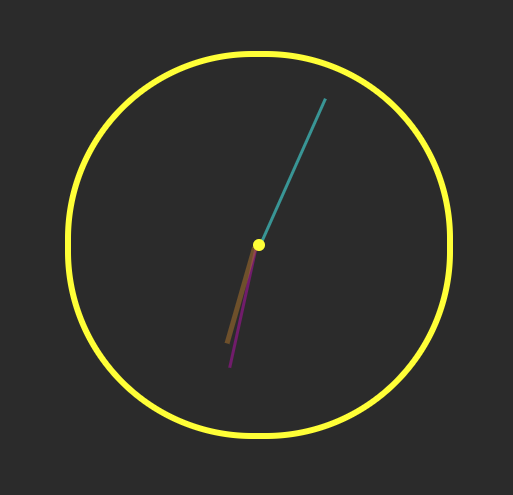

# Analog Clock

Um relógio analógico em JavaScript, HTML e CSS.

 <a href="https://htmlpreview.github.io/?https://github.com/andremarcos13/js-analog-clock/blob/main/index.html">Preview do código funcionando.
